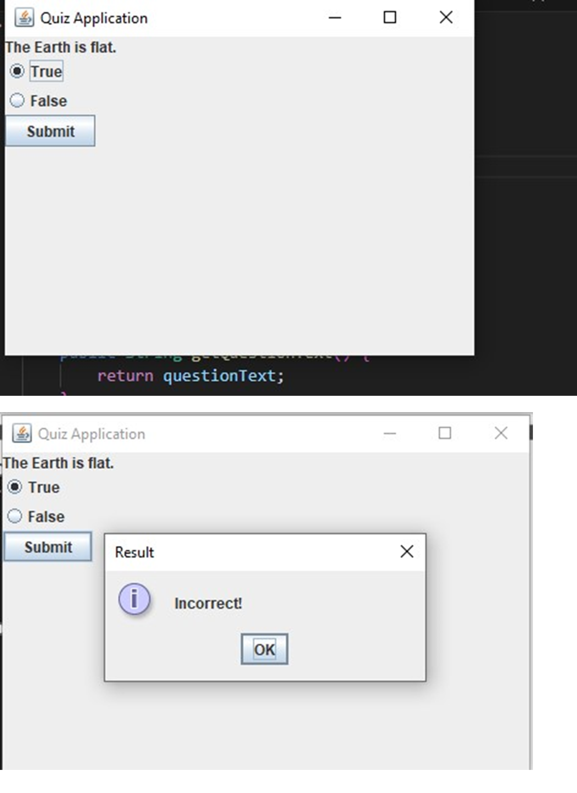

# Quiz Application GUI

This is a simple Quiz Application developed in Java using Swing for the graphical user interface. The application presents multiple-choice and true/false questions, tracks the user's score, and displays the final result.

## Features
- Multiple-choice questions with radio button selections.
- True/False questions.
- Interactive GUI using Java Swing.
- Real-time score tracking.
- Final result display.

## Technologies Used
- Java
- Swing (JFrame, JPanel, JLabel, JButton, JRadioButton, JOptionPane)

## How to Run
1. Clone the repository:
   ```sh
   git clone https://github.com/your-username/quiz-application.git
   ```
2. Navigate to the project directory:
   ```sh
   cd quiz-application
   ```
3. Compile the Java files:
   ```sh
   javac QuizApplicationGUI.java
   ```
4. Run the application:
   ```sh
   java QuizApplicationGUI
   ```

## Screenshots



## Code Structure
- `Question` (Abstract class): Represents a generic question.
- `MultipleChoiceQuestion` (Extends `Question`): Handles multiple-choice questions.
- `TrueFalseQuestion` (Extends `Question`): Handles true/false questions.
- `QuizApplicationGUI`: Manages the quiz flow and user interface.

## License
This project is licensed under the MIT License.

## Author
- **Muhammad Daniyal**
- GitHub: [Muhammad Daniyal](https://github.com/danideveloper50)
